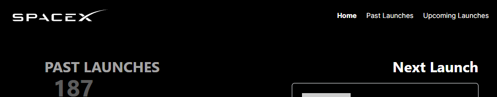

# Iniciando o projeto

Para iniciar o projeto

### Primeiro instale as dependências:

```sh
pnpm install
```

### Adicione o arquivo .env (`.env.exemple`)

```env
INTERNAL_API_URL=http://localhost:3000/api/
SPACEX_API_URL=https://api.spacexdata.com/v5/
```

### Depois inicie a aplicação em modo de desenvolvimento

```sh
pnpm dev
```

#### Acesse pelo link `http://localhost:3000` ou o endereço informado no terminal

# Frontend

### O site foi dividido em 4 paginas:

#### Home (/)

Exibe a quantidade de lançamentos executados e futuros além do proximo e ultimo para serem visualizados

#### [Visualizar](https://spacexlaunches.gabrielhenrique.net/)

#### Past Launches (/launches/past)

Retorna todos os lançamentos anteriores com suas respectivas informações

#### [Visualizar](https://spacexlaunches.gabrielhenrique.net/launches/past)

#### Upcoming Launches (/launches/upcoming)

Retorna todos os lançamentos futuros com suas respectivas informações

#### [Visualizar](https://spacexlaunches.gabrielhenrique.net/launches/upcoming)

#### Launch (/launch/[id])

Exibe todas as informações do lançamento baseado no id com links, descrição, video e outros dados.

#### [Visualizar](https://spacexlaunches.gabrielhenrique.net/launch/607a37565a906a44023e0866)

## Teste A/B (Google Optimize)

Foi adicionar o experimento de alteração do estilo do menu

### Variante (A) Original



### Variante (B) (Menu em Uppercase)


# Backend (API)

### GET /api/launches/next

#### [Visualizar](https://spacexlaunches.gabrielhenrique.net/api/launches/next)

A rota retorna os dados do proximo lançamento

### GET /api/launches/last

#### [Visualizar](https://spacexlaunches.gabrielhenrique.net/api/launches/last)

A rota retorna os dados do ultimo lançamento

### GET /api/launches/upcoming

#### [Visualizar](https://spacexlaunches.gabrielhenrique.net/api/launches/upcoming)

A rota retorna os dados dos próximos lançamentos

### GET /api/launches/past

#### [Visualizar](https://spacexlaunches.gabrielhenrique.net/api/launches/past)

A rato retorna os dados dos lançamentos anteriores

# Testes

## Jest + Testing Library

```
pnpm test
```

## Cypress

### Para realizar o teste End-to-end execute o seguinte comando

(É necessário que a aplicação esteja rodando em modo de desenvolvimento `pnpm dev`)

```
pnpm e2e
```
